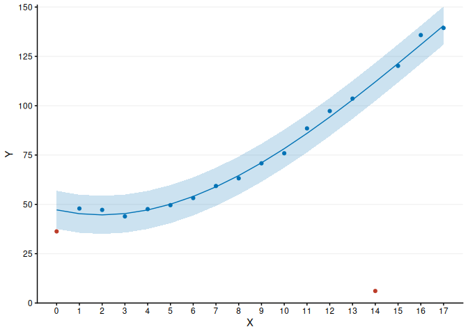

<!-- README.md is generated from README.Rmd. Please edit that file -->

# OncReg

<!-- badges: start -->
<!-- badges: end -->

Tools for working with cancer registry data.

## Installation

You can install the development version of OncReg from
[GitHub](https://github.com/hongconsulting/OncReg) with:

``` r
remotes::install_github("hongconsulting/OncReg")
```

### Example: comma-separated free text

``` r
library(OncReg)
treatment <- c("capecitabine",
               "LETROZOLE",
               "letrozole, palbociclib",
               "Letrozole,Ribociclib",
               "anastrozole, ribociclib")
treatment <- OR.delim.replace(treatment, "anastrozole", "ai")
treatment <- OR.delim.replace(treatment, "letrozole", "ai")
treatment <- OR.delim.replace(treatment, "palbociclib", "cdk46i")
treatment <- OR.delim.replace(treatment, "ribociclib", "cdk46i")
print(treatment)
#> [1] "capecitabine" "ai"           "ai, cdk46i"   "ai, cdk46i"   "ai, cdk46i"
```

### Example: immortal time bias

``` r
library(OncReg)
library(survival)
set.seed(24601)
n <- 500
data <- data.frame("id" = 1:n)
data$date.event <- rexp(n, rate = log(2)/6)
data$date.censor <- rexp(n, rate = log(2)/12)
data$time <- pmin(data$date.event, data$date.censor)
data$status <- as.numeric(data$date.event <= data$date.censor)

# patients undergo cycle 1 of placebo treatment at 1 month
data$date.cycle1 <- 1
data$date.cycle1[runif(n) < 0.05] <- NA
data$date.cycle1[data$date.cycle1 > data$time] <- NA
data$binary.cycle1 <- as.numeric(!is.na(data$date.cycle1))

# cycle 1 of placebo treatment as a binary indicator appears effective due to immortal time bias
coxph(Surv(data$time, data$status) ~ data$binary.cycle1)
#> Call:
#> coxph(formula = Surv(data$time, data$status) ~ data$binary.cycle1)
#> 
#>                       coef exp(coef) se(coef)      z        p
#> data$binary.cycle1 -1.0791    0.3399   0.1391 -7.759 8.54e-15
#> 
#> Likelihood ratio test=48.57  on 1 df, p=3.183e-12
#> n= 500, number of events= 331

# cycle 1 of placebo treatment as a time-dependent covariate recovers the null effect
OR.tdCox(data$id, data$time, data$status, X.tdc = data.frame("cycle1" = data$date.cycle1))
#> Call:
#> survival::coxph(formula = stats::as.formula(formula), data = data, 
#>     model = TRUE)
#> 
#>          coef exp(coef) se(coef)     z     p
#> cycle1 0.1164    1.1234   0.2446 0.476 0.634
#> 
#> Likelihood ratio test=0.23  on 1 df, p=0.6286
#> n= 897, number of events= 331
```

### Example: Microsoft Excel dates and survival analysis

``` r
library(OncReg)
data0 <- data.frame("id" = 1:5, 
                    "diagnosis" = c("01/01/00", "01/01/2000", "36526", "36526",
                                    "36526"), 
                    "progression" = c("01/01/2001", ".", "01/01/2001", "", NA), 
                    "review1" = c("01/07/2001", "01/07/2001", "01/07/2001", 
                                  "01/07/2001", "01/07/2001"), 
                    "review2" = c(NA, NA, NA, NA, "01/01/2002"), 
                    "death" = c("01/01/2002", "01/01/2002", NA, NA, NA))
print(data0)
#>   id  diagnosis progression    review1    review2      death
#> 1  1   01/01/00  01/01/2001 01/07/2001       <NA> 01/01/2002
#> 2  2 01/01/2000           . 01/07/2001       <NA> 01/01/2002
#> 3  3      36526  01/01/2001 01/07/2001       <NA>       <NA>
#> 4  4      36526             01/07/2001       <NA>       <NA>
#> 5  5      36526        <NA> 01/07/2001 01/01/2002       <NA>

# Microsoft Excel dates
data1 <- data.frame("id" = data0$id)
data1$diagnosis <- OR.date.Excel(data0$diagnosis)
data1$progression <- OR.date.Excel(data0$progression)
data1$review1 <- OR.date.Excel(data0$review1)
data1$review2 <- OR.date.Excel(data0$review2)
data1$death <- OR.date.Excel(data0$death)

# progression-free survival date is the date of progression or death, whichever is earlier
# last review date is the latest date patient was observed alive
data1$PFS <- OR.rowmin(cbind(data1$progression, data1$death)) 
data1$lastreview <- OR.rowmax(cbind(data1$review1, data1$review2))
print(data1)
#>   id diagnosis progression review1 review2 death   PFS lastreview
#> 1  1     36526       36892   37073      NA 37257 36892      37073
#> 2  2     36526          NA   37073      NA 37257 37257      37073
#> 3  3     36526       36892   37073      NA    NA 36892      37073
#> 4  4     36526          NA   37073      NA    NA    NA      37073
#> 5  5     36526          NA   37073   37257    NA    NA      37257

# progression-free survival and overall survival
data2 <- data.frame("id" = data1$id)
data2$PFSmonths <- OR.survoutcome(data1$diagnosis, data1$PFS, data1$lastreview)[, 1]
data2$PFSstatus <- OR.survoutcome(data1$diagnosis, data1$PFS, data1$lastreview)[, 2]
data2$OSmonths <- OR.survoutcome(data1$diagnosis, data1$death, data1$lastreview)[, 1]
data2$OSstatus <- OR.survoutcome(data1$diagnosis, data1$death, data1$lastreview)[, 2]
print(data2)
#>   id PFSmonths PFSstatus OSmonths OSstatus
#> 1  1  12.02489         1 24.01692        1
#> 2  2  24.01692         1 24.01692        1
#> 3  3  12.02489         1 17.97162        0
#> 4  4  17.97162         0 17.97162        0
#> 5  5  24.01692         0 24.01692        0
```

### Example: outlier detection

``` r
y <- c(36.3, 47.9, 47.2, 43.9, 47.6, 49.6, 53.2, 59.3, 63.2, 70.8, 75.9, 88.5,
       97.3, 103.6, 6.1, 120.2, 135.8, 139.4)
x <- 1:length(y) - 1
fig1 <- OR.outliers.rlm.ggplot(x, y, max.degree = 4, p = 0.0027, x.title = "X",
                               y.breaks = seq(0, 150, 25), y.title = "Y")
print(fig1)
```


